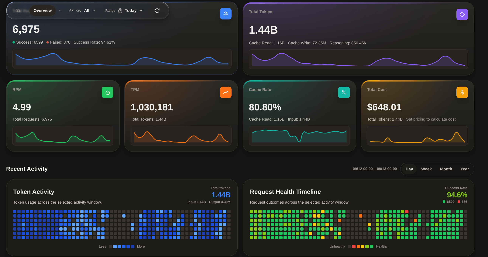
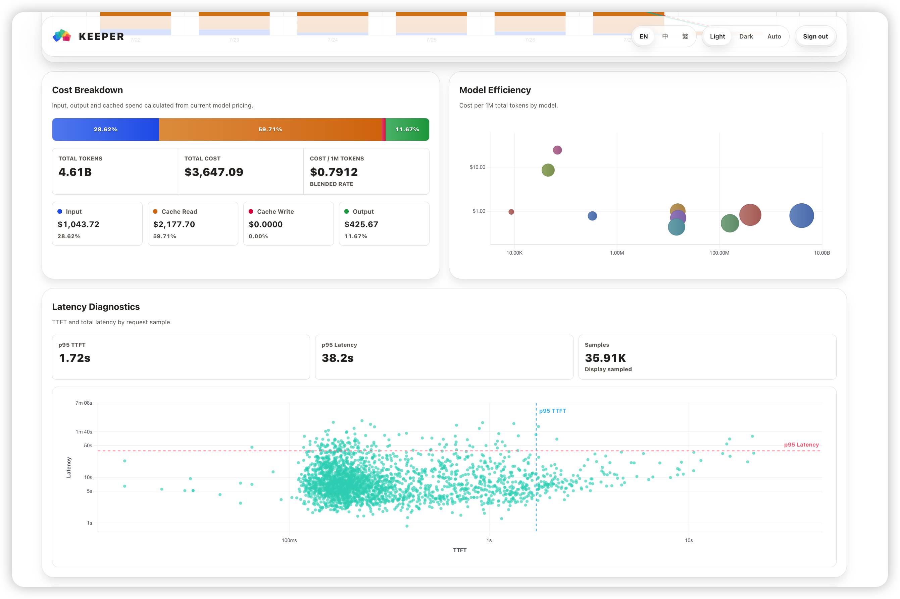
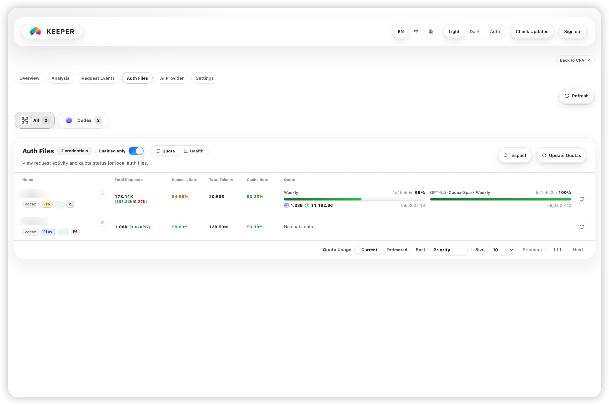
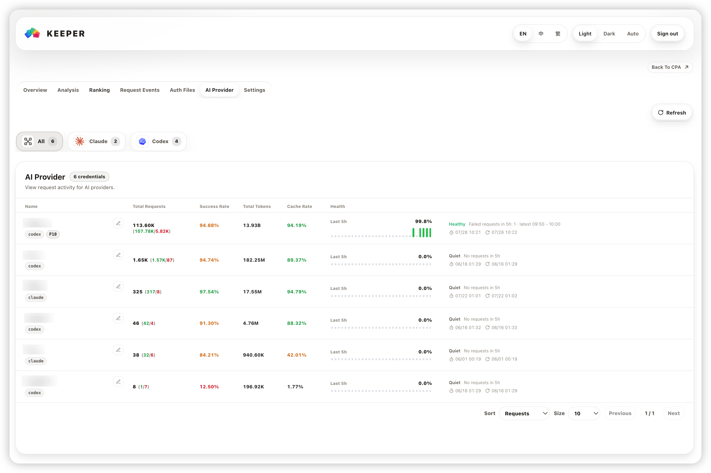
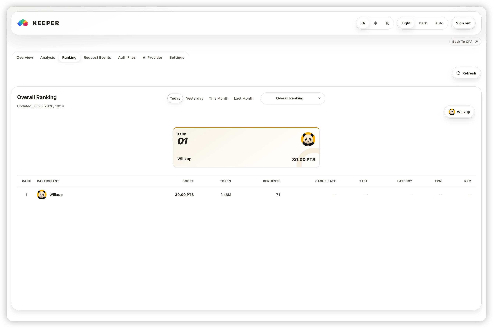
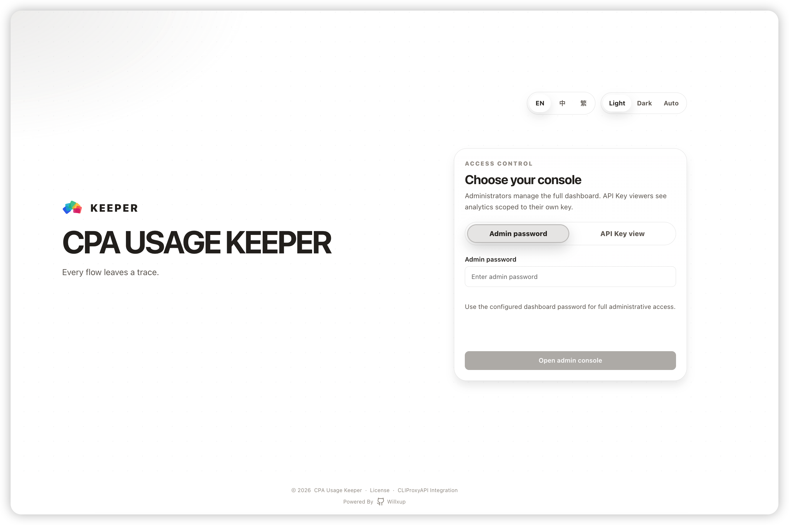

<p align="center">
  <picture>
    <source media="(prefers-color-scheme: dark)" srcset="./assets/keeper-logo-dark.svg" />
    <source media="(prefers-color-scheme: light)" srcset="./assets/keeper-logo-light.svg" />
    
  </picture>
</p>

<h1 align="center">CPA Usage Keeper</h1>

<p align="center"><em>모든 흐름은 흔적을 남긴다.</em></p>

<p align="center">
  <a href="./README.md">English</a> ｜ <a href="./README.zh.md">简体中文</a> ｜ <strong>한국어</strong>
</p>

<p align="center">
  <a href="https://github.com/jc01rho/cpa-usage-keeper/releases/latest"></a>
  <a href="https://github.com/jc01rho/cpa-usage-keeper/actions/workflows/ci.yml"></a>
  <a href="https://github.com/jc01rho/cpa-usage-keeper/releases/latest"></a>
  <a href="https://github.com/jc01rho/cpa-usage-keeper/releases/latest"></a>
  <a href="https://github.com/jc01rho/cpa-usage-keeper/releases/latest"></a>
  <a href="./LICENSE"></a>
</p>

> **이 프로젝트는** [jc01rho](https://github.com/jc01rho)가 유지 관리하는 [CPA Usage Keeper](https://github.com/Willxup/cpa-usage-keeper)의 **포크**이며, [CLIProxyAPIPlus](https://github.com/jc01rho/CLIProxyAPIPlus) 포크와 함께 사용하도록 만들어졌습니다.
>
> 이 포크는 업스트림을 충실히 따라가며, 주로 연동 대상(업스트림 CLIProxyAPI 대신 CLIProxyAPIPlus)에서만 차이가 납니다.

CPA Usage Keeper는 [CLIProxyAPI (CPA)](https://github.com/router-for-me/CLIProxyAPI)를 위한 독립형 사용량 영속화 및 분석 대시보드입니다. CPA 사용량을 SQLite에 저장하고, CPA 설정 및 자격 증명 데이터를 가져오며, 사용량, 비용, 요청 상태, 할당량, 모델/API 통계를 확인할 수 있는 뷰를 제공합니다.

## 스크린샷

<p align="center">
  <picture>
    <source media="(prefers-color-scheme: dark)" srcset="./assets/screenshots/overview-dark.png" />
    <source media="(prefers-color-scheme: light)" srcset="./assets/screenshots/overview-light.png" />
    
  </picture>
  <picture>
    <source media="(prefers-color-scheme: dark)" srcset="./assets/screenshots/analysis-dark.png" />
    <source media="(prefers-color-scheme: light)" srcset="./assets/screenshots/analysis-light.png" />
    
  </picture>
</p>
<p align="center">
  <picture>
    <source media="(prefers-color-scheme: dark)" srcset="./assets/screenshots/auth-files-dark.png" />
    <source media="(prefers-color-scheme: light)" srcset="./assets/screenshots/auth-files-light.png" />
    
  </picture>
  <picture>
    <source media="(prefers-color-scheme: dark)" srcset="./assets/screenshots/ai-provider-dark.png" />
    <source media="(prefers-color-scheme: light)" srcset="./assets/screenshots/ai-provider-light.png" />
    
  </picture>
</p>
<p align="center">
  <picture>
    <source media="(prefers-color-scheme: dark)" srcset="./assets/screenshots/ranking-dark.png" />
    <source media="(prefers-color-scheme: light)" srcset="./assets/screenshots/ranking-light.png" />
    
  </picture>
  <picture>
    <source media="(prefers-color-scheme: dark)" srcset="./assets/screenshots/login-dark.png" />
    <source media="(prefers-color-scheme: light)" srcset="./assets/screenshots/login-light.png" />
    
  </picture>
</p>

## 이 포크를 쓰는 이유

업스트림이 제공하는 모든 기능에 더해, [CLIProxyAPIPlus](https://github.com/jc01rho/CLIProxyAPIPlus)와 함께 실행하는 데 필요한 요소들을 포함합니다:

| 추가 기능 | 설명 |
| --- | --- |
| **멀티 인스턴스 지원** | 하나의 Keeper에 여러 CPA 인스턴스를 등록합니다. 인스턴스별로 사용량, 랭킹, 요청 이벤트를 필터링할 수 있으며, 결정적 `Legacy` 인스턴스가 마이그레이션 이전 데이터를 그대로 유지합니다. |
| **Keeper export 프로토콜 (`/api/v1/export/*`)** | 사용량 배치와 메타데이터(인증 파일, API 키, 프로바이더 아이덴티티)를 위한 Bearer 자격 증명 푸시 API입니다. 엄격한 JSON 검증, 재전송 안전 수집, Argon2id 해시 자격 증명을 제공합니다. [운영자 런북](docs/keeper-export.md)을 참조하세요. |
| **tokscale 브리지** | `scripts/tokscale_bridge.py`가 Keeper에서 가격이 책정된 사용량을 gjc JSONL로보내 [tokscale](https://github.com/junhoyeo/tokscale) 분석 및 리더보드 제출에 사용하며, 선택적 systemd 타이머를 지원합니다. [docs/tokscale-bridge.md](docs/tokscale-bridge.md)를 참조하세요. |
| **OpenRouter 가격 동기화** | 선택적 `OPENROUTER_API_KEY`로 비용 추정을 위한 모델 가격을 자동으로 가져옵니다. |
| **원시 이벤트 정리 토글** | `CLEANUP_USAGE_EVENTS_ENABLED`가 일일 유지 관리에서 90일(로컬 기준)이 지난 `usage_events` 삭제 여부를 제어합니다. |

## 기능

- [Keeper export 운영자 런북](docs/keeper-export.md) — 마이그레이션, 자격 증명, 수집, 복구, 릴리스 운영.
- CPA 사용량 데이터를 SQLite에 영속화하고, 선택적 예약 백업 지원
- 요청, 토큰, 비용, 캐시 사용량, 성공률, RPM/TPM, 지연 시간을 추적하고 기간, 모델, API Key, 소스, 결과별 필터 제공
- 요청 단위 이벤트를 설정 가능한 테이블 컬럼으로 조회 및보내기
- 사용량 추세, 비용 구성, 모델/API Key/AI Provider 비중, 시간대별 히트맵, 지연 시간 진단 분석
- 사용량 지표, 상태 점검, 할당량 새로고침을 포함한 Auth Files 및 AI Providers 모니터링
- 종합 점수, 토큰, 요청 수, 캐시 비율, 평균 TTFT/지연 시간, 피크 TPM/RPM 기준 커뮤니티 랭킹 참여
- 개별 CPA API Key 범위로 제한된 읽기 전용 사용량 뷰 제공
- CPA Auth Files, API Keys, AI Providers 자동 동기화 및 비용 추정용 모델 가격 유지
- Docker/Docker Compose, 바이너리, systemd로 배포하고 선택적 비밀번호 보호 지원
- CPA 플러그인을 통해 Keeper 대시보드를 CPAMC에 임베드

## 후원 및 감사

- 업스트림 CPA 기반과 이 프로젝트의 데이터 소스를 제공해 준 [CLIProxyAPI (CPA)](https://github.com/router-for-me/CLIProxyAPI)에 감사드립니다.
- CPA Usage Keeper를 후원해 주신 [@YouShouldBetOnMe](https://github.com/YouShouldBetOnMe)에게 감사드립니다.
- 논의와 피드백을 나눠준 CPA 토론 그룹에 감사드립니다.

## 빠른 시작

> CPA Usage Keeper를 사용하기 전에 CPA 사용량 통계가 활성화되어 있는지 확인하세요: `usage-statistics-enabled: true`.
>
> 여러 사용량 수집기가 하나의 CPA 인스턴스를 공유하는 경우, 모두 구독(subscription) 모드를 사용하는지 확인하세요. 그렇지 않으면 수집이 중단되거나 불완전해질 수 있습니다.

Docker Compose가 권장 배포 방식입니다. CPA와 Keeper를 함께 배포할 때는 전체 스택을, CPA가 이미 존재할 때는 Keeper 전용 스택을 사용하세요.

| 환경 | 권장 경로 | 아키텍처 |
| --- | --- | --- |
| 신규 CPA + Keeper 배포 | [Docker Compose: CPA + Keeper](#docker-compose-권장) (이미지를 로컬에서 빌드) | `linux/amd64`, `linux/arm64` |
| 기존 CPA 배포 | [Docker Compose: Keeper 전용](#docker-compose-권장) (이미지를 로컬에서 빌드) | `linux/amd64`, `linux/arm64` |
| 기존 CPA, Docker CLI 선호 | [Docker](#docker-cpa가-호스트에서-이미-실행-중) (이미지를 로컬에서 빌드) | `linux/amd64`, `linux/arm64` |
| macOS | [macOS 바이너리](#macos-바이너리) | `amd64`, `arm64` |
| 컨테이너 없는 Linux | [Linux 바이너리](#linux-바이너리) | `amd64`, `arm64` |
| Windows | [Windows 바이너리](#windows-바이너리) | `amd64`, `arm64` |

> 이 포크는 Docker 이미지나 Homebrew tap을 배포하지 않습니다. 컨테이너 배포는 포함된 `Dockerfile`로 이미지를 빌드하고, macOS는 릴리스 바이너리를 사용합니다.

로그인 보호가 기본으로 활성화되어 있습니다. Keeper를 시작하기 전에 `LOGIN_PASSWORD`를 설정하거나, 배포 환경에서 접근이 확실히 격리된 경우에만 `AUTH_ENABLED=false`로 명시적으로 설정하세요.

## 벤치마크

지속 수집, 대시보드 지연 시간, CPU 사용률, Keeper cgroup 피크 메모리에 대한 프로덕션 유사 `linux/amd64` 용량 측정 결과는 [Capacity Benchmark Report](./internal/benchmark/REPORT.md)에서 확인할 수 있습니다.

## 프로젝트 구조

```text
cmd/server/              Application entry point
internal/api/            HTTP routes and handlers
internal/app/            Application wiring and startup
internal/auth/           Sessions and access control
internal/poller/         CPA usage and metadata synchronization
internal/repository/     SQLite persistence and aggregations
internal/service/        Usage, pricing, and identity services
internal/quota/          Provider quota refresh and inspection
internal/ranking/        Community ranking aggregation and sync
internal/benchmark/      Capacity suite, reports, manifests, and legacy microbenchmarks
deploy/                  Deployment templates
web/                     React + TypeScript frontend
```

## 로컬 개발

### 사전 요구 사항

- Go 1.26+
- Node.js 24+
- npm
- 실행 중인 [CLIProxyAPI (CPA)](https://github.com/router-for-me/CLIProxyAPI) 인스턴스

### 로컬에서 실행

1. `.env.example`을 `.env`로 복사한 후 최소한 `CPA_BASE_URL`과 `CPA_MANAGEMENT_KEY`를 설정합니다.

```bash
cp .env.example .env
vim .env
```

2. 백엔드를 시작합니다.

```bash
go run ./cmd/server/main.go
```

3. 다른 터미널에서 프론트엔드 의존성을 설치하고 개발 서버를 시작합니다.

```bash
npm --prefix ./web ci
npm --prefix ./web run dev -- --host 127.0.0.1
```

`http://127.0.0.1:5173`을 여세요. 프론트엔드는 `/api`를 `http://127.0.0.1:8080`으로 프록시하며, 백엔드가 다른 포트를 사용할 때는 `VITE_API_PROXY_TARGET`으로 재정의할 수 있습니다.

### 테스트

전체 검증 베이스라인을 실행합니다:

```bash
make verify
```

또는 각 검사를 개별적으로 실행합니다:

```bash
go test ./cmd/... ./internal/...
npm --prefix ./web run test
npm --prefix ./web run lint
npm --prefix ./web run typecheck
npm --prefix ./web run build
```

## 배포

### Docker Compose (권장)

완전한 CPA + Keeper 스택과 Keeper 전용 배포 모두에 Docker Compose를 권장합니다.

#### CPA + Keeper

다음 내용을 `docker-compose.yml`로 저장한 후 관리 키와 로그인 비밀번호를 교체하세요:

```yaml
services:
  cli-proxy-api:
    image: eceasy/cli-proxy-api:latest
    container_name: cli-proxy-api
    restart: unless-stopped
    ports:
      - "8317:8317"
      - "1455:1455"
    volumes:
      - ./cpa/config.yaml:/CLIProxyAPI/config.yaml
      - ./cpa/auths:/root/.cli-proxy-api
      - ./cpa/logs:/CLIProxyAPI/logs
    networks:
      - cpa-network

  cpa-usage-keeper:
    build:
      context: https://github.com/jc01rho/cpa-usage-keeper.git
    container_name: cpa-usage-keeper
    restart: unless-stopped
    depends_on:
      - cli-proxy-api
    ports:
      - "8080:8080"
    environment:
      TZ: Asia/Shanghai # Sets the container timezone; log timestamps use this timezone.
      CPA_BASE_URL: http://cli-proxy-api:8317
      CPA_MANAGEMENT_KEY: replace-with-your-management-key
      REDIS_QUEUE_ADDR: cli-proxy-api:8317
      AUTH_ENABLED: true
      LOGIN_PASSWORD: ${KEEPER_LOGIN_PASSWORD:?set KEEPER_LOGIN_PASSWORD}
    volumes:
      - ./keeper:/data
    networks:
      - cpa-network

networks:
  cpa-network:
    driver: bridge
```

시작하기 전에 셸 또는 Compose `.env` 파일에 `KEEPER_LOGIN_PASSWORD`를 설정하세요.

이 포크는 Docker 이미지를 배포하지 않으므로 위의 `build`가 이 저장소에서 Keeper를 컴파일합니다. 대신 로컬 체크아웃을 사용하려면 `build` 블록을 클론 내부의 `build: .`로 교체하세요.

`docker compose up -d`로 스택을 시작하고 `docker compose down`으로 중지합니다.

CPA 데이터는 `./cpa` 아래에, Keeper 데이터는 `./keeper` 아래에 저장됩니다.

#### Keeper 전용

CPA가 이미 배포되어 있다면 저장소의 Keeper 전용 Compose 템플릿을 사용하세요. 템플릿은 업스트림 이미지를 참조하지만 이 포크는 이미지를 배포하지 않으므로, `image` 대신 `build`를 로컬 클론(또는 원격 `context`)으로 지정하세요:

```bash
cp deploy/docker-compose.example.yml docker-compose.yml
cp .env.example .env
vim .env
# in docker-compose.yml, replace `image: ghcr.io/willxup/cpa-usage-keeper:latest` with:
#   build: .
```

Docker 호스트에서 실행 중인 CPA의 경우 다음으로 시작하세요:

```env
CPA_BASE_URL=http://host.docker.internal:8317
CPA_MANAGEMENT_KEY=replace-with-your-management-key
AUTH_ENABLED=true
LOGIN_PASSWORD=
```

컨테이너를 시작하기 전에 비공개 `LOGIN_PASSWORD`를 설정하세요.

다른 네트워크 구성에서는 `CPA_BASE_URL`을 접근 가능한 CPA 주소로 설정하세요. CPA가 기본이 아닌 Redis/RESP 주소를 사용하는 경우 `REDIS_QUEUE_ADDR`도 설정하세요.

`docker compose up -d`로 Keeper를 시작하고 `docker compose down`으로 중지합니다.

제공된 템플릿은 Keeper 데이터를 `./data` 아래에 저장합니다.

### Docker (CPA가 호스트에서 이미 실행 중)

로컬 클론에서 이미지를 빌드한 후 Keeper 전용 Compose 설정과 동일한 `.env` 값을 사용하세요:

```bash
docker build -t cpa-usage-keeper .
docker run -d \
  --name cpa-usage-keeper \
  --add-host=host.docker.internal:host-gateway \
  -p 8080:8080 \
  -v "$(pwd)/keeper:/data" \
  --env-file .env \
  cpa-usage-keeper
```

### macOS 바이너리

[Releases](https://github.com/jc01rho/cpa-usage-keeper/releases/latest)에서 `darwin_amd64` 또는 `darwin_arm64` 아카이브를 다운로드한 후 압축을 풀고 실행하세요:

```bash
mkdir -p cpa-usage-keeper
tar -xzf ./cpa-usage-keeper_*_darwin_*.tar.gz -C cpa-usage-keeper --strip-components=1
cd cpa-usage-keeper
cp .env.example .env
vim .env
./cpa-usage-keeper
```

시작하기 전에 `CPA_BASE_URL`, `CPA_MANAGEMENT_KEY`, 비공개 `LOGIN_PASSWORD`를 설정하세요. macOS에서 Keeper를 백그라운드 서비스로 실행하려면 `launchd` plist를 만들거나 원하는 프로세스 관리자를 사용하세요.

### Linux 바이너리

[Releases](https://github.com/jc01rho/cpa-usage-keeper/releases/latest)에서 `linux_amd64` 또는 `linux_arm64` 아카이브를 다운로드한 후 압축을 풀고 실행하세요:

```bash
mkdir -p cpa-usage-keeper
tar -xzf ./cpa-usage-keeper_*_linux_*.tar.gz -C cpa-usage-keeper --strip-components=1
cd cpa-usage-keeper
cp .env.example .env
vim .env
./cpa-usage-keeper
```

#### systemd

Linux 패키지에는 서비스 템플릿이 포함되어 있습니다. 압축을 푼 패키지 디렉터리에서 다음 명령을 실행하세요:

```bash
sudo cp cpa-usage-keeper.service /etc/systemd/system/cpa-usage-keeper.service
sudo sed -i "s|__CPA_USAGE_KEEPER_DIR__|$(pwd)|g" /etc/systemd/system/cpa-usage-keeper.service
sudo systemctl daemon-reload
sudo systemctl enable --now cpa-usage-keeper
```

```bash
sudo systemctl status cpa-usage-keeper
sudo journalctl -u cpa-usage-keeper -f
sudo systemctl restart cpa-usage-keeper
```

### 명령줄 옵션

바이너리는 선택적 시작 플래그를 지원합니다:

```bash
cpa-usage-keeper --host 127.0.0.1 # Override APP_HOST for this process.
cpa-usage-keeper -v               # Print the build version and exit; --version is also supported.
```

### Windows 바이너리

[Releases](https://github.com/jc01rho/cpa-usage-keeper/releases/latest)에서 `windows_amd64` 또는 `windows_arm64` ZIP 패키지를 다운로드하고 압축을 푸세요. PowerShell에서 압축을 푼 패키지 디렉터리를 열고 다음을 실행하세요:

```powershell
Copy-Item .env.example .env
notepad .env
.\cpa-usage-keeper.exe
```

시작하기 전에 `CPA_BASE_URL`, `CPA_MANAGEMENT_KEY`, 비공개 `LOGIN_PASSWORD`를 설정하세요. 인증은 기본으로 활성화되어 있으며, 격리된 배포에서만 `AUTH_ENABLED=false`로 명시적으로 설정하세요.

## 설정

예제 설정을 복사하세요:

```bash
cp .env.example .env
```

처음 배포하는 경우 "최소 필수"와 "웹 접근 및 리버스 프록시"부터 시작하세요. 나머지 대부분의 설정은 기본값을 유지해도 됩니다.

### 최소 필수

| 변수 | 필수 | 기본값 | 설명 |
| --- | --- | --- | --- |
| `CPA_BASE_URL` | 예 | - | Keeper 서버가 CPA를 호출하는 데 사용하는 URL. Docker Compose에서는 보통 `http://cli-proxy-api:8317`이며, 사설 주소나 컨테이너 서비스 이름도 가능 |
| `CPA_MANAGEMENT_KEY` | 예 | - | CPA 관리 API를 읽는 데 사용하는 CPA 관리 키 |

### 웹 접근 및 리버스 프록시

| 변수 | 필수 | 기본값 | 설명 |
| --- | --- | --- | --- |
| `APP_HOST` | 아니오 | 모든 인터페이스 | Keeper HTTP 리슨 호스트. 네이티브 배포에서는 로컬 전용 접근을 위해 `127.0.0.1`로 설정 가능 |
| `APP_PORT` | 아니오 | `8080` | Keeper HTTP 리슨 포트 |
| `APP_BASE_PATH` | 아니오 | 루트 경로 | `/keeper` 같은 Keeper 하위 경로 접두사. 비어 있으면 `/` |
| `CPA_PUBLIC_URL` | 아니오 | 현재 브라우저 오리진 루트 | "CPA로 돌아가기" 링크와 CPAMC 프레임 신뢰를 위한 공개 CPA URL |
| `TRUSTED_PROXY_CIDRS` | 아니오 | 로컬 루프백만 | `X-Forwarded-For`를 제공할 수 있는 추가 리버스 프록시 CIDR, 쉼표로 구분 |

- `--host` 시작 플래그가 `APP_HOST`를 재정의합니다. 둘 다 설정되지 않으면 Keeper는 기존 동작을 유지하며 사용 가능한 모든 네트워크 인터페이스에서 리슨합니다.
- Docker/Compose에서는 `APP_HOST`를 비워 두세요. Docker 호스트로 접근을 제한하려면 포트를 `127.0.0.1:8080:8080`으로 게시하세요.
- `APP_BASE_PATH`는 비어 있거나 `/`로 시작해야 하며, `/cpa/`는 `/cpa`로 정규화됩니다.
- `CPA_BASE_URL`은 서버 측 CPA 주소이며 사설 호스트나 Docker 서비스 이름을 사용할 수 있습니다.
- `CPA_PUBLIC_URL`은 브라우저 탐색과 크로스 오리진 CPAMC 프레임 신뢰를 제어합니다. 동일 오리진 `/management.html`에는 비워 두고, 도메인, 포트, 경로가 다르면 명시적 공개 CPA URL을 설정하세요.
- Keeper는 로컬 루프백과 `TRUSTED_PROXY_CIDRS`에서 온 `X-Forwarded-For`만 신뢰합니다. 직접 연결된 클라이언트는 이 헤더로 로그인 레이트 리밋 소스를 변경할 수 없습니다. 정확한 프록시 주소나 네트워크만 설정하세요. 범용 CIDR은 거부됩니다.

크로스 오리진 CPAMC 임베딩의 경우 `CPA_PUBLIC_URL`은 호스트를 포함한 완전한 `http://` 또는 `https://` URL이어야 합니다. 상대 경로는 탐색에만 영향을 줍니다.

### 로그인 보호

| 변수 | 필수 | 기본값 | 설명 |
| --- | --- | --- | --- |
| `AUTH_ENABLED` | 아니오 | `true` | 로그인 보호 활성화 |
| `LOGIN_PASSWORD` | 인증 활성화 시 | - | 로그인 비밀번호 |
| `AUTH_SESSION_TTL` | 아니오 | `168h` | 로그인 세션 수명 |
| `API_KEY_VIEWER_LOCAL_RANKING_ENABLED` | 아니오 | `false` | API Key 뷰어가 Local Ranking을 읽을 수 있도록 허용. Community Ranking은 읽기 전용으로 유지 |

### 시간대 및 요청 동작

| 변수 | 필수 | 기본값 | 설명 |
| --- | --- | --- | --- |
| `TZ` | 아니오 | `Asia/Shanghai` | 통계 및 표시에 사용하는 시간대. 오늘, 일일 합계, 페이지 타임스탬프, 로그 타임스탬프, 일일 정리가 이 시간대 기준으로 계산됨 |
| `REQUEST_TIMEOUT` | 아니오 | `30s` | CPA HTTP 요청 및 Redis 큐 작업의 타임아웃 |
| `TLS_SKIP_VERIFY` | 아니오 | `false` | CPA HTTPS 및 Redis 큐 TLS의 인증서 검증 건너뛰기. 자체 서명 인증서에서만 활성화 |

### Auth Files 할당량 새로고침

예약된 Auth Files 할당량 새로고침은 Auth Files 점검 대화 상자의 톱니바퀴 버튼에서 설정합니다. 설정은 로컬 SQLite 데이터베이스에 저장되며 페이지를 열어 둘 필요가 없습니다.

| 변수 | 필수 | 기본값 | 설명 |
| --- | --- | --- | --- |
| `QUOTA_REFRESH_WORKER_LIMIT` | 아니오 | `10` | 수동 및 예약 새로고침의 최대 Auth Files 할당량 새로고침 동시성, 최대 `100` |
| `QUOTA_UPSTREAM_RESPONSES_ENABLED` | 아니오 | `false` | 각 자격 증명의 최신 원시 업스트림 할당량 응답을 캐시하고 할당량 작업/캐시 API를 통해 반환하여 브라우저 Network 디버깅 지원. 응답에 계정 데이터가 포함될 수 있음 |

### Redis 큐 고급 설정

| 변수 | 필수 | 기본값 | 설명 |
| --- | --- | --- | --- |
| `REDIS_QUEUE_ADDR` | 아니오 | `CPA_BASE_URL` 호스트명 + `8317` | CPA Redis/RESP TCP 주소. 보통 비워 둠. 기본이 아닌 포트나 별도로 노출된 Redis 스트림에는 `host:port` 설정 |
| `REDIS_QUEUE_TLS` | 아니오 | `false` | Redis 큐 연결에 TLS 사용. `REDIS_QUEUE_ADDR`이 명시적이고 TLS가 필요할 때 `true`로 설정 |
| `REDIS_QUEUE_BATCH_SIZE` | 아니오 | `10000` | 한 번의 pull당 최대 큐 레코드 수 |
| `REDIS_QUEUE_IDLE_INTERVAL` | 아니오 | `1s` | 빈 큐 확인 간격 |

### 스토리지, 로그, 백업

| 변수 | 필수 | 기본값 | 설명 |
| --- | --- | --- | --- |
| `WORK_DIR` | 아니오 | `./data` | 애플리케이션 작업 디렉터리. 데이터베이스, 로그, 백업은 기본적으로 그 아래의 `app.db`, `logs/`, `backups/` |
| `LOG_LEVEL` | 아니오 | `info` | 로그 레벨 |
| `LOG_FILE_ENABLED` | 아니오 | `true` | 영속 로그 파일 작성 |
| `LOG_RETENTION_DAYS` | 아니오 | `7` | 통합 로그 보관 일수(당일 포함). `0`은 정리 비활성화. 오류 전용 로그는 30일 + 당일 보관 |
| `BACKUP_ENABLED` | 아니오 | `true` | SQLite 데이터베이스 백업 활성화 |
| `BACKUP_INTERVAL` | 아니오 | `24h` | 데이터베이스 백업 간격 |
| `BACKUP_RETENTION_DAYS` | 아니오 | `7` | 백업 보관 일수 |

Keeper는 매일 04:30 유지 관리 시간에 로컬 달력 기준 90일이 지난 원시 `usage_events`를 영구 보관되는 `usage_events_archive` 콜드 테이블로 자동 이동합니다. 아카이브는 향후 스키마 마이그레이션 재구축을 위해 예약되어 있으며 일반 대시보드 API에서는 조회되지 않습니다.

파일 로깅이 활성화되면 `cpa-usage-keeper-YYYY-MM-DD.log`에 출력된 모든 레벨이 포함됩니다. Error, fatal, panic 항목은 `cpa-usage-keeper-error-YYYY-MM-DD.log`에도 복사되며, 이 파일은 이전 30개 로컬 달력 날짜와 당일을 보관합니다.

### 내장 HTTPS

| 변수 | 필수 | 기본값 | 설명 |
| --- | --- | --- | --- |
| `TLS_ENABLED` | 아니오 | `false` | Keeper가 HTTPS/TLS를 직접 제공하도록 함 |
| `TLS_CERT_FILE` | TLS 활성화 시 필수 | - | HTTPS 인증서 파일 경로 |
| `TLS_KEY_FILE` | TLS 활성화 시 필수 | - | HTTPS 개인 키 파일 경로 |

일반적으로 HTTPS는 nginx, Caddy 또는 다른 리버스 프록시에서 종료해야 합니다. Keeper 프로세스가 HTTPS를 직접 제공해야 하는 경우에만 `TLS_ENABLED=true`로 설정하고 `TLS_CERT_FILE`과 `TLS_KEY_FILE`을 제공하세요. 상대 경로는 `.env` 파일 디렉터리 기준으로 해석됩니다.

보안 및 데이터 참고 사항:

- 브라우저 API는 키 형태의 필드를 마스킹하지만, SQLite 데이터베이스와 암호화되지 않은 백업에는 원본 데이터가 포함됩니다.
- 인증은 기본으로 활성화되어 있습니다. 명시적으로 비활성화한 경우 배포 경계에서 Keeper 접근을 제한하고, 공개 HTTPS는 리버스 프록시에서 종료하세요.
- 로그인 세션 해시는 로그아웃 또는 `AUTH_SESSION_TTL` 만료까지 SQLite에 유지됩니다.
- CPAMC는 별도의 임베드 세션을 사용합니다: 가능하면 `HttpOnly` 쿠키, 아니면 브라우저 세션 스토리지의 탭별 헤더 토큰을 폴백으로 사용합니다.
- 동일 오리진 임베딩은 기본으로 동작합니다. 크로스 오리진 임베딩의 경우 `CPA_PUBLIC_URL`을 `frame-ancestors`에 사용할 공개 CPA/CPAMC 오리진으로 설정하세요.
- Redis 인박스 메시지는 성공 후 당일까지, 실패 후 7일간 보관됩니다.

## Nginx 리버스 프록시

`/cpa` 아래에서 서빙할 때는 `APP_BASE_PATH=/cpa`를 설정하고 리버스 프록시에 접두사를 유지하세요:

```nginx
location /cpa/ {
    proxy_pass http://127.0.0.1:8080;
    proxy_set_header Host $host;
    proxy_set_header X-Forwarded-Proto $scheme;
    proxy_set_header X-Forwarded-For $proxy_add_x_forwarded_for;
}
```

위의 루프백 Nginx 설정은 추가 Keeper 설정 없이 동작합니다. 리버스 프록시가 컨테이너나 다른 호스트에서 Keeper에 접근하는 경우, 예를 들어 `TRUSTED_PROXY_CIDRS=172.18.0.0/16`처럼 정확한 프록시 네트워크를 추가하세요.

CPA와 Keeper가 브라우저 오리진을 공유하면 `CPA_PUBLIC_URL`을 생략할 수 있으며 "CPA로 돌아가기"는 `/management.html`을 사용합니다. 다른 도메인, 포트, 경로의 경우 공개 CPA URL을 설정하세요:

```env
CPA_PUBLIC_URL=https://cpa.example.com
```

## 라이선스

이 프로젝트는 [MIT License](./LICENSE) 하에 오픈 소스로 제공됩니다.
